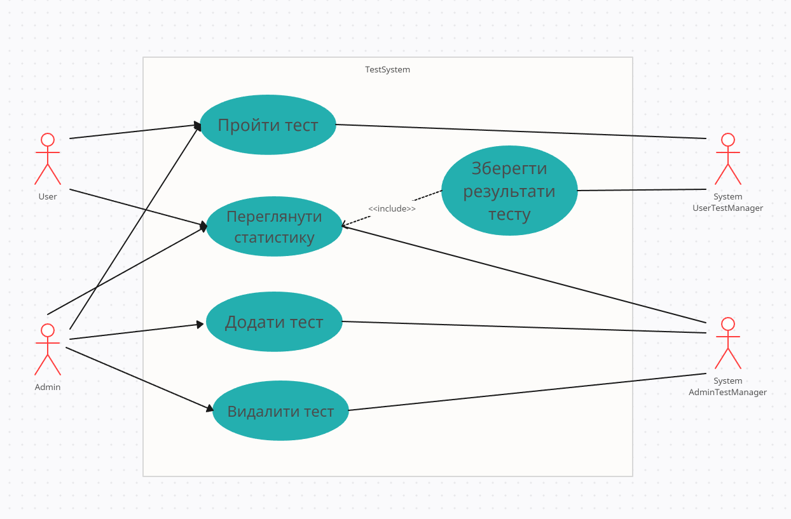

# Тестування

Проект у ООП стилі з темою Тестування
# Стек технологій
* Python/SQLalchemy
* PostgreSQL

# Основне завдання:
Реалізувати систему перевірки знань, що підтримує 6-10 різних видів тестових питань
(введення відповіді, часткове співпадіння, вибір відповідей з переліку, шкала оцінки,
встановлення відповідностей та ін.). Надати можливість створювати сценарії тестів та
запускати процес проходження тестів на основі різних типів питань (передбачити
можливість, коли результати відповідей впливають складність та тематику наступних
питань). Створити кілька тестів та реалізувати процес проходження тестів на оцінку.
Додати режим адміністратора для створення та збереження тестів. Передбачити
обробку статистики по усім збереженим результатам окремого тесту (середній бал,
розподіл оцінок, найбільш складні питання тощо).

# UML case use diagram

У нашого користувача на даній версії програми є 4 види дій які представлені на нашій 
діаграмі прецедентів
* System UserTestManager - под капотом реалізація наших методів для проходження користувачем тестів,
та також зберігання їх результатів
* System AdminTestManager - под капотом реалізація методів для створення тестів, видалення,
та переглядання статистики