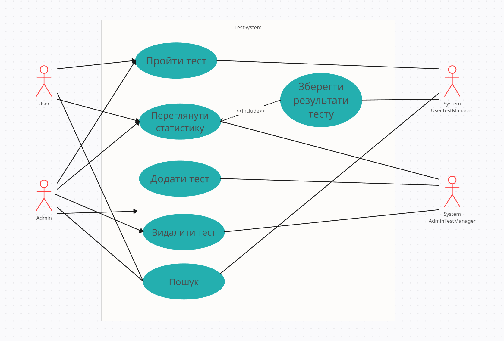
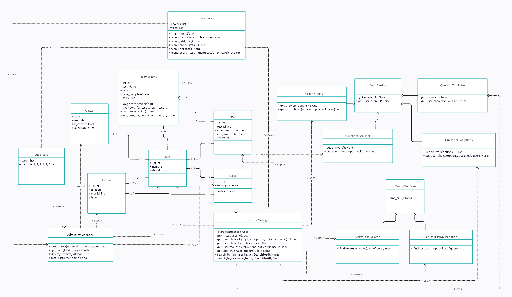
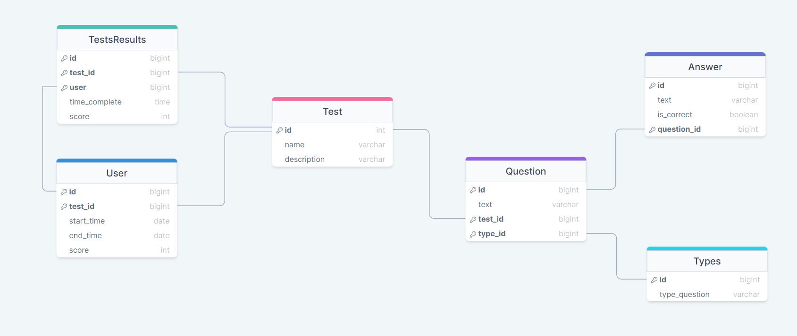

# Тестування

Проект у ООП стилі з темою Тестування
# Стек технологій
* Python/SQLalchemy
* PostgreSQL

# Основне завдання:
Реалізувати систему перевірки знань, що підтримує 6-10 різних видів тестових питань
(введення відповіді, часткове співпадіння, вибір відповідей з переліку, шкала оцінки,
встановлення відповідностей та ін.). Надати можливість створювати сценарії тестів та
запускати процес проходження тестів на основі різних типів питань (передбачити
можливість, коли результати відповідей впливають складність та тематику наступних
питань). Створити кілька тестів та реалізувати процес проходження тестів на оцінку.
Додати режим адміністратора для створення та збереження тестів. Передбачити
обробку статистики по усім збереженим результатам окремого тесту (середній бал,
розподіл оцінок, найбільш складні питання тощо).

# UML case use diagram

У нашого користувача на даній версії програми є 5 види дій які представлені на нашій 
діаграмі прецедентів
* System UserTestManager - под капотом реалізація наших методів для проходження користувачем тестів,
та також зберігання їх результатів
* System AdminTestManager - под капотом реалізація методів для створення тестів, видалення,
та переглядання статистики

# UML Class Diagram

На етапі другої лабораторної роботи маємо в програмі реалізовані 18 классів, де маємо ідею Наслідування,
Абстрактних класів, шаблон проектування Фасад, Менеджери для роботи з классами об'єктів, та також клас 'фікстури'

# DB Tables(Objects)

## Test (Модель для збереження тестів):

Представляє тест з інформацією про назву та опис.
Має зв'язок з питаннями через відношення questions.
Містить методи для ініціалізації та представлення об'єкта в рядковому вигляді.

## Question (Модель для збереження питань для тесту):

Представляє питання в тесті з текстом питання та посиланням на тест, до якого воно відноситься.
Має зв'язки з тестом через test та з відповідями через answers.
Містить методи для ініціалізації та представлення об'єкта в рядковому вигляді.

## Answer (Модель для збереження відповідей до питань): 

Представляє відповідь на питання з текстом відповіді та позначкою її правильності.
Має зв'язок з питанням через question.
Містить методи для ініціалізації та представлення об'єкта в рядковому та репрезентативному вигляді.

## User (Модель для збереження користувачів тесту):

Представляє користувача, який проходить тест, з інформацією про тест, час початку тесту, час закінчення та результат.
Містить методи для ініціалізації та представлення об'єкта в рядковому вигляді.

## TestsResults (Модель для збереження статистики по пройденим тестам):

Представляє статистику про тести, пройдені користувачами, з інформацією про тест, користувача, час проходження та результат.
Містить методи для ініціалізації та представлення об'єкта в рядковому вигляді, а також для обчислення середнього 
балу та середнього часу проходження тестів.

## Types (Модель для збереження типів питань)

Types - модель для типів питань, з полями id і type_question. Має зв'язок з питаннями (questions) і метод 
exists, який перевіряє існування типу питань за ім'ям.
